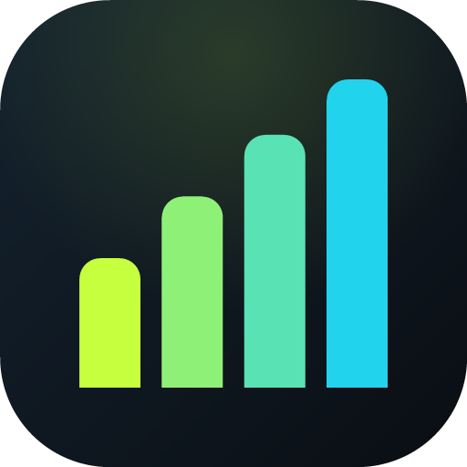

# Cali100 — Calisthenics da 0 a 100 💪

App di allenamento **calisthenics a corpo libero, da casa, senza attrezzatura**.
Un percorso progressivo di **100 livelli** (schede), dal principiante assoluto (livello 0)
fino alle skill più avanzate (planche, front lever, verticale, muscle-up).

È una **PWA** (Progressive Web App): funziona **offline**, si **installa** sul telefono
come una normale app e tutti i dati restano **solo sul tuo dispositivo**.
Da qui puoi anche generare un vero **APK Android** (vedi sotto).

<p align="center"></p>

---

## ✨ Cosa include

- **Percorso 0 → 100**: 100 schede generate in modo progressivo, divise in 5 fasi
  (Fondamenta · Costruzione · Forza · Avanzato · Elite & Skill). Ogni livello ha
  riscaldamento, blocchi di lavoro con serie/ripetizioni/tenute e recuperi calibrati,
  e defaticamento. La difficoltà cresce con il livello.
- **Player di allenamento guidato**: timer del recupero automatico, timer per gli
  esercizi isometrici e a tempo, conteggio ripetizioni, segnali acustici,
  schermo che resta acceso durante la sessione.
- **Libreria di 100+ esercizi** con categoria, muscoli coinvolti, tecnica corretta,
  errori comuni, difficoltà 1–10 e progressione/regressione collegate.
- **Skill tree** per le 6 skill iconiche: Verticale, Planche, Front Lever, Muscle-up,
  L-sit, Pistol squat — con tappe e obiettivi.
- **Gamification**: livello del percorso (0–100), XP, streak (giorni di fila),
  trofei/achievement, calendario degli allenamenti.
- **Progressi**: storico, record personali (PR) automatici e manuali, statistiche.
- **Timer libero** per circuiti HIIT / Tabata personalizzati.
- **Backup**: esporta/importa i tuoi dati (JSON) per trasferirli su un altro telefono.

> ℹ️ **"Senza attrezzatura"**: gli esercizi sono pensati per il corpo libero.
> Alcuni movimenti di trazione (pull-up, front lever, muscle-up) danno il meglio con
> una **sbarra**: per questi l'app propone sempre un'**alternativa da pavimento**
> (es. rematore australiano sotto un tavolo robusto, rematore con asciugamano su una maniglia).

---

## 📲 Installare l'app sul telefono (Android)

Ci sono due strade. La **1** è la più semplice e non richiede nessuno store.

### 1) Come PWA (consigliato — installazione in 10 secondi)

1. Pubblica l'app online (vedi *Pubblicare su GitHub Pages* qui sotto), oppure aprila
   dal tuo indirizzo Pages.
2. Aprila con **Chrome** su Android.
3. Menu (⋮) → **Installa app** / **Aggiungi a schermata Home**.
4. Comparirà l'icona Cali100 tra le tue app: si apre a tutto schermo, funziona **offline**
   e si comporta come un'app nativa.

### 2) Come APK Android vero e proprio (sideload personale)

Se vuoi proprio un file **`.apk`** da installare:

1. Pubblica l'app su GitHub Pages (sotto) e prendi l'URL, ad esempio:
   `https://<tuo-utente>.github.io/desktop-tutorial/calisthenics-app/`
2. Vai su **[PWABuilder.com](https://www.pwabuilder.com/)** e incolla quell'URL.
3. **Package For Stores → Android → Generate**. Scarica il pacchetto.
4. Nel pacchetto trovi un APK di test firmato (`*-signed.apk`). Copialo sul telefono.
5. Su Android: **Impostazioni → App → Installa app sconosciute** → consenti a
   "Gestione file/Chrome" → apri l'APK → **Installa**.

> L'APK generato da PWABuilder è un wrapper (TWA) attorno alla stessa PWA: hai bisogno
> che il sito resti pubblicato online. Per un uso 100% offline e senza store, la **strada 1**
> (installazione PWA) è la scelta migliore.

---

## 🌐 Pubblicare su GitHub Pages (gratis)

Nel repository è incluso il workflow [`.github/workflows/pages.yml`](../.github/workflows/pages.yml)
che pubblica **solo** questa cartella.

1. Su GitHub: **Settings → Pages → Build and deployment → Source = "GitHub Actions"**.
2. Fai il merge su `main` (il deploy parte in automatico) **oppure** lancia il workflow
   a mano da **Actions → "Deploy Cali100 PWA su GitHub Pages" → Run workflow**.
3. Al termine, l'app sarà su:
   `https://<tuo-utente>.github.io/desktop-tutorial/calisthenics-app/`

> I dati dell'allenamento non lasciano mai il dispositivo: la pagina è pubblica, ma tutto
> ciò che registri (progressi, record, streak) è salvato solo nel tuo browser.

---

## 💻 Provare l'app in locale

Serve un piccolo server statico (i service worker non funzionano aprendo il file con `file://`).

```bash
cd calisthenics-app
python3 -m http.server 8099
# poi apri http://localhost:8099/ nel browser
```

In alternativa: `npx serve .` oppure l'estensione *Live Server* di VS Code.

---

## 🗂️ Struttura del progetto

```
calisthenics-app/
├── index.html               # shell dell'app + navigazione
├── manifest.webmanifest     # metadati PWA (nome, icone, tema)
├── sw.js                    # service worker (offline-first)
├── assets/
│   ├── css/styles.css       # tema scuro, mobile-first
│   ├── js/
│   │   ├── data.js          # database esercizi + skill tree + fasi
│   │   ├── levels.js        # generatore delle 100 schede progressive
│   │   └── app.js           # router, player, timer, gamification, storage
│   └── icons/               # icone PWA (generate)
└── tools/
    └── gen-icons.mjs        # genera le icone PNG (Node, senza dipendenze)
```

Tutto è **vanilla JS**, senza build step e senza dipendenze a runtime.

---

## 🔧 Personalizzare

- **Aggiungere un esercizio**: aggiungi un oggetto in `assets/js/data.js` (array `E`),
  con `id`, `name`, `cat`, `diff`, `type`, `rep`/`hold`/`dur`, `cues`, `errori`, ecc.
  Inseriscilo eventualmente in una "scala" di `assets/js/levels.js` per farlo comparire
  nelle schede.
- **Cambiare le progressioni dei 100 livelli**: modifica le `LAD` (scale per pattern),
  i `TPL` (template di seduta per fase) o `PHASE_CLAMP` in `assets/js/levels.js`.
- **Rigenerare le icone**: `node tools/gen-icons.mjs`.

---

## ⚠️ Nota di sicurezza

Consulta un medico prima di iniziare un nuovo programma di allenamento. Ascolta il tuo
corpo, cura la tecnica prima del volume e rispetta i giorni di recupero. Le skill avanzate
(planche, front lever, muscle-up) richiedono mesi/anni di preparazione progressiva.

---

_Cali100 · PWA offline · uso personale · Made for calisthenics 🤸_
